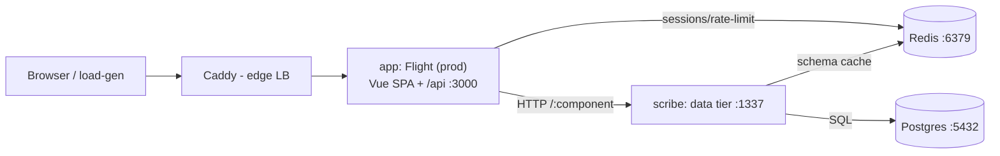
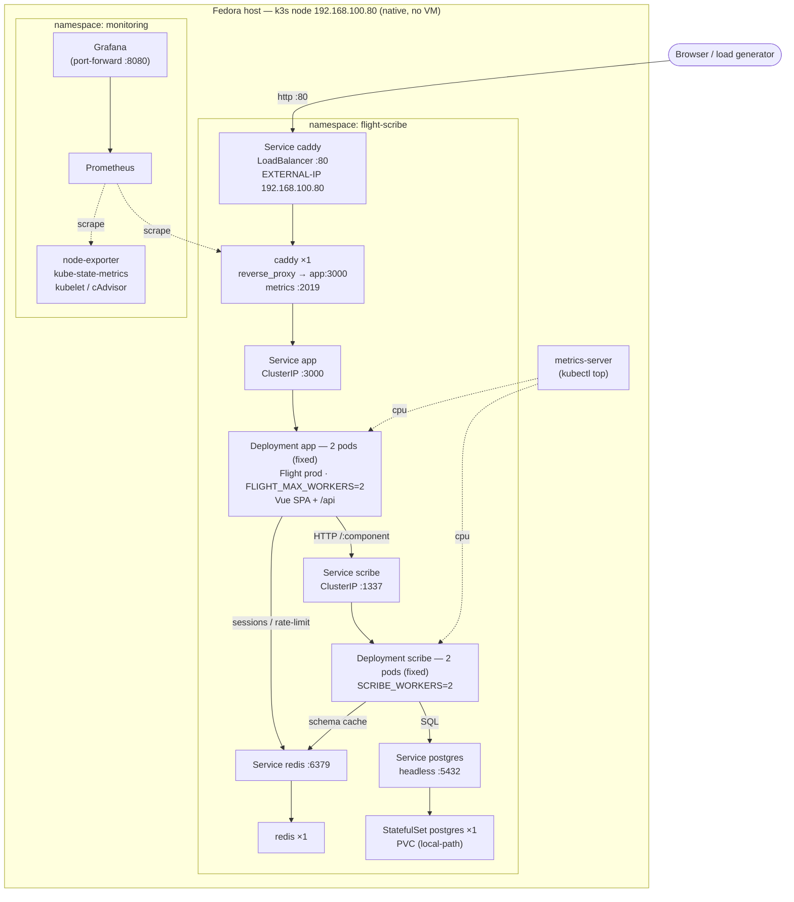

# Flight + Scribe + my-vue-app — Local Setup & Run Guide

An end-to-end walkthrough for running the full stack on your machine, two ways:

- **Dev loop** — fastest iteration (hot-reload UI), app runs on the host, infra in Docker.
- **k3s cluster** — the whole thing containerized on a local Kubernetes cluster with
  independent scaling, Caddy load-balancing, and Prometheus/Grafana observability
  (this is the perf-testing target).

---

## 1. What's in the stack



| Tier | What it is | Image |
| --- | --- | --- |
| **app** | Flight (Koa) in production serving the built Vue SPA **and** the `/api` routes on one port | `my-vue-app:local` (built `FROM flightjs:local`) |
| **scribe** | Data tier — turns JSON-Schema components into Postgres tables on the fly | `scribe:local` |
| **postgres** | Storage | `postgres:16-alpine` |
| **redis** | Flight sessions/rate-limit (db 0) + Scribe schema cache (db 1) | `redis:7-alpine` |
| **caddy** | Reverse proxy / edge load balancer | `caddy:2-alpine` |

### Repo layout
```
/home/vasilen/
├── flight/              # business-logic framework (Koa)      — build source for flightjs:local
├── scribe/              # data-tier framework (Express + PG)  — build source for scribe:local
├── my-vue-app/          # YOUR app: Vue 3 SPA + components/**/*.backend.ts (Flight routes)
└── flight-scribe-dev/   # ← this harness: compose, Dockerfiles, k8s manifests, docs
    ├── docker-compose.yml            # dev infra: postgres + redis + caddy
    ├── docker-compose.scribe.yml     # dev: scribe as a container (bind-mount)
    └── deploy/
        ├── build.sh                  # build all 3 images
        ├── flight.Dockerfile         # flightjs:local (base image)
        ├── app.Dockerfile            # my-vue-app:local
        ├── scribe.Dockerfile         # scribe:local
        ├── docker-compose.stack.yml  # fully-containerized stack (compose)
        └── k8s/                      # k3s manifests + setup scripts (see deploy/k8s/README.md)
```

### Current k3s topology (as deployed)

What's actually running now on the cluster — Services (dashed = metrics scrape, solid = request path)
front each Deployment and round-robin across its pods; HPAs and metrics-server drive scaling.



---

## 2. Prerequisites

| Tool | Needed for | Notes |
| --- | --- | --- |
| **Docker** | both modes | Docker Desktop or native `docker-ce`. `docker version` must show a running server. |
| **Node ≥ 20.19** | dev loop only | my-vue-app's Vite 8 requires it. (k3s mode builds inside Docker — no host Node needed.) |
| **pnpm 10** | dev loop only | `npm i -g pnpm@10` (pnpm 11 needs Node 22). |
| **sudo** | k3s mode | k3s runs as a systemd service. |

> **Fedora + Docker Desktop note:** Docker Desktop on Linux runs a VM. For k3s we install a
> *native* k3s (no VM). Docker is only used here to **build** images; k3s runs them itself.

Verify Docker before anything else:
```bash
docker version        # must print both Client and Server
```
If you get `command not found`, Docker isn't on your PATH / Docker Desktop isn't running.

---

## 3. Mode A — Dev loop (hot reload)

Best while writing code. Flight + Vite run on the host; Postgres/Redis/Caddy/Scribe run in Docker.

```bash
# 1) Infra + Scribe (containers)
cd /home/vasilen/flight-scribe-dev
docker compose -f docker-compose.yml -f docker-compose.scribe.yml up -d
docker compose -f docker-compose.yml -f docker-compose.scribe.yml ps   # wait: postgres/redis healthy

# 2) App: Flight (business logic) + Vite (UI), on the host
cd /home/vasilen/my-vue-app
pnpm install
pnpm flight            # → Flight :3000 (API) + Vite :3001 (UI)
```

Open **http://localhost:3001** — the Vue app; its `/api/*` calls are proxied to Flight `:3000`.

Stop:
```bash
# Ctrl-C the `pnpm flight` process, then:
cd /home/vasilen/flight-scribe-dev
docker compose -f docker-compose.yml -f docker-compose.scribe.yml down     # add -v to wipe data
```

---

## 4. Mode B — Full stack on k3s (perf testing)

Everything containerized on a native k3s cluster. Run these from a **host terminal** (not the
VS Code integrated terminal), as **your normal user** (the scripts `sudo` internally where needed).

### 4.1 Build the images
```bash
cd /home/vasilen/flight-scribe-dev
sh deploy/build.sh
docker images | grep local        # expect flightjs:local, my-vue-app:local, scribe:local
```

### 4.2 Bring up the cluster (one command)
```bash
sh deploy/k8s/setup-k3s.sh
```
This is idempotent and does, in order:
1. Installs **k3s** with Traefik disabled (we front with Caddy); keeps servicelb + metrics-server.
2. **Fedora firewalld:** trusts the pod (`10.42.0.0/16`) and service (`10.43.0.0/16`) CIDRs and
   restarts k3s — without this, pods can't reach each other (`EHOSTUNREACH`).
3. Imports `my-vue-app:local` + `scribe:local` into k3s's containerd.
4. `kubectl apply` of all manifests in `deploy/k8s/`.
5. Installs **kube-prometheus-stack** (Prometheus + Grafana + node-exporter + kube-state-metrics)
   and the Caddy ServiceMonitor.

> Don't run it with `sudo` — `docker save` must run as *you* (Docker Desktop's daemon isn't
> reachable by root). It will prompt for your sudo password for the k3s/import steps.

### 4.3 Check it's healthy
```bash
export KUBECONFIG=/etc/rancher/k3s/k3s.yaml     # k3s wrote this world-readable
kubectl -n flight-scribe get pods,svc,hpa
kubectl -n flight-scribe get svc caddy          # note EXTERNAL-IP (your node IP)
```
All pods should be `Running` / `1/1`.

### 4.4 Use it
```bash
IP=$(kubectl -n flight-scribe get svc caddy -o jsonpath='{.status.loadBalancer.ingress[0].ip}')
echo "http://$IP/"

curl -s http://$IP/api/notes                                   # list
curl -s -XPOST http://$IP/api/notes -H 'content-type: application/json' \
     -d '{"title":"hello","body":"from k3s"}'                  # create
```
Or open **http://<node-ip>/** in a browser for the Vue UI.

### 4.5 Rebuild after a code change
```bash
sh deploy/build.sh                                             # rebuild image(s)
sh deploy/k8s/load-images.sh                                   # re-import into k3s
kubectl -n flight-scribe rollout restart deploy/app deploy/scribe
```

---

## 5. Scaling

**Autoscaling is currently OFF** — `app` and `scribe` are pinned at **2 pods each** (HPAs deleted;
`deploy/k8s/60-hpa.yaml` renamed to `.disabled` so `setup-k3s.sh` won't re-create them). Scale by hand:
```bash
kubectl -n flight-scribe scale deploy/app    --replicas=4
kubectl -n flight-scribe scale deploy/scribe --replicas=3
```
To re-enable CPU autoscaling: `mv deploy/k8s/60-hpa.yaml.disabled deploy/k8s/60-hpa.yaml` then
`kubectl apply -f deploy/k8s/60-hpa.yaml` (app 2–10, scribe 2–6).

The `app` and `scribe` ClusterIP Services round-robin across their pods; Caddy balances external
traffic to the `app` Service. Watch it during a load test:
```bash
watch kubectl -n flight-scribe get pods,hpa
```

---

## 6. Observability

- **CPU / memory / network** — Grafana ships with cluster & pod dashboards
  ("Kubernetes / Compute Resources / …"). Also `kubectl top pods -n flight-scribe`.
- **Latency (edge)** — Caddy exposes Prometheus metrics; in Grafana Explore:
  - p95: `histogram_quantile(0.95, sum(rate(caddy_http_request_duration_seconds_bucket[1m])) by (le))`
  - rps: `sum(rate(caddy_http_requests_total[1m]))`

Open Grafana (it stays `<pending>` as a LoadBalancer because Caddy owns node port 80 — use port-forward):
```bash
kubectl -n monitoring port-forward svc/monitoring-grafana 8080:80
# → http://localhost:8080   (admin / admin)
```
Prometheus:
```bash
kubectl -n monitoring port-forward svc/monitoring-kube-prometheus-prometheus 9090
```

---

## 7. Load testing

Ready-made 50k-request harness (k6 or hey): **[deploy/k8s/loadtest/README.md](deploy/k8s/loadtest/README.md)**.
Quick version (no install):
```bash
IP=$(kubectl -n flight-scribe get svc caddy -o jsonpath='{.status.loadBalancer.ingress[0].ip}')
docker run --rm -i -e BASE_URL=http://$IP grafana/k6 run - < deploy/k8s/loadtest/notes-loadtest.js
```
Watch pods/HPA scale (`watch kubectl -n flight-scribe get pods,hpa`) and Grafana latency panels.

> **Rate limit:** Flight's prod limiter (1200 req/min per IP) is env-configurable and set to
> **off** in `30-app.yaml` (`FLIGHT_RATE_LIMIT_DISABLE=true`) so load tests aren't throttled.
> Use `FLIGHT_RATE_LIMIT_MAX`/`FLIGHT_RATE_LIMIT_DURATION_MS` to set a real limit instead.

---

## 8. Troubleshooting

| Symptom | Cause / Fix |
| --- | --- |
| `docker: command not found` | Docker not on PATH / Desktop not running. Use a host terminal; check `docker version`. |
| Pod CrashLoop, `EHOSTUNREACH <pod-ip>` | Fedora firewalld blocking pod/service traffic. Fixed by `setup-k3s.sh`; manual: trust `10.42.0.0/16` + `10.43.0.0/16` in the `trusted` zone, `firewall-cmd --reload`, `systemctl restart k3s`. |
| scribe `OOMKilled` (exit 137) | Scribe forks a worker per host CPU. Capped by `SCRIBE_WORKERS` (set to `2` in `20-scribe.yaml`); keep in step with `limits.cpu`. |
| `ctr: unrecognized image format` on import | You ran the import as root — `docker save` must run as your user (Docker Desktop). Run `setup-k3s.sh`/`load-images.sh` **without** sudo. |
| Grafana Service `<pending>` | Expected — Caddy owns node port 80. Reach Grafana via `port-forward` (see §6). |
| Helm hangs on "Installing it now" | Not a hang — it's pulling images. Don't Ctrl-C (leaves the release `pending-install`; recover with `helm -n monitoring uninstall monitoring`). The script no longer uses `--wait`. |

Handy:
```bash
kubectl -n flight-scribe describe pod <pod>          # events + last-terminated reason
kubectl -n flight-scribe logs <pod> [--previous]     # crash logs
```

---

## 9. Teardown

```bash
# App stack only
kubectl delete -f deploy/k8s/
helm -n monitoring uninstall monitoring

# Nuke the whole cluster
sudo /usr/local/bin/k3s-uninstall.sh

# Dev-mode infra
cd /home/vasilen/flight-scribe-dev
docker compose -f docker-compose.yml -f docker-compose.scribe.yml down -v
```

---

## 10. Reference

- k8s specifics (per-file rundown, queries): [deploy/k8s/README.md](deploy/k8s/README.md)
- The original harness notes & known issues: [README.md](README.md)
- Benchmarking procedures (Node vs Bun, Bun vs Java vs Python): [BENCHMARKS.md](BENCHMARKS.md)
- Load-generator options and `ab.sh` env knobs: [deploy/k8s/loadtest/README.md](deploy/k8s/loadtest/README.md)
- Cross-runtime peers (Spring, FastAPI, Zig-vs-Rust): [deploy/k8s/bench/README.md](deploy/k8s/bench/README.md)
- Where to run scribe (sidecar / shared / sharded) and why: [docs/scribe-topologies.md](docs/scribe-topologies.md)
