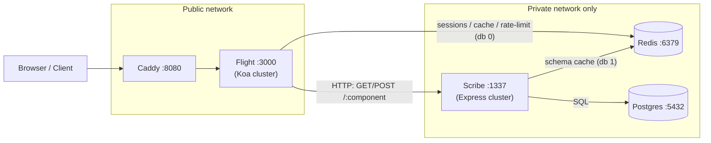

# Flight + Scribe — Local Dev Stack

This folder is a **dev harness** that runs [Flight](../flight) (the business-logic /
edge tier) and [Scribe](../scribe) (the data tier) together on one machine, with
Postgres, Redis, and Caddy provided by Docker.

Neither framework repo is modified — this harness sits beside them:

```
/home/vasilen/
├── flight/              # business-logic tier (Koa)   → this repo
├── scribe/              # data tier (Express + Postgres)
└── flight-scribe-dev/   # ← you are here (compose, Caddy, env, docs)
```

> **Looking for the benchmarks?** This README covers the **Docker Compose dev loop** only.
> The k3s performance cluster — Node vs Bun, and Bun vs Java vs Python — lives in
> **[BENCHMARKS.md](BENCHMARKS.md)**. See also [GUIDE.md](GUIDE.md) (both modes end to end),
> [deploy/k8s/README.md](deploy/k8s/README.md) (cluster internals), and
> [docs/scribe-topologies.md](docs/scribe-topologies.md) (where to run scribe, and why).

---

## 1. How the two projects work together

**Flight** and **Scribe** are two independent servers that split a backend into
two tiers. They do **not** import each other — they communicate over HTTP.



### Flight — the business-logic tier

- A **Koa** server that clusters one worker per CPU.
- On boot it globs `**/*.backend.ts` under your app root and mounts each file's
  default export as Koa routes. Your **domain logic lives in these files.**
- Provides the cross-cutting HTTP concerns: **Redis-backed sessions**, **rate
  limiting**, **compression**, CORS, and either a **Vite dev server** (dev) or a
  **static + SPA fallback pipeline** (prod).
- Has **no database of its own.** When a route needs data, it makes an HTTP call
  to Scribe.
- UI: Vue or React via Vite (your app's `vite.config` chooses).

### Scribe — the data tier

- An **Express** server that turns **JSON-Schema component definitions** into
  Postgres tables **on the fly.** Drop a `Users.schema.json`, `POST /users`, and
  the table + columns are created automatically. This is the "speed up entity
  creation" idea.
- CRUD + subcomponents, **version history** ("time machine"), relationship
  queries (parents/children/references), and a raw **`POST /sql`** passthrough.
- Uses **Redis (db 1)** to cache component schemas; **Postgres** for storage.
- Designed to run **inside a private network only** — it has no authentication.

### The contract between them

Today the coupling is **purely conventional** — there is no Scribe client
library inside Flight and no shared types. A Flight `*.backend.ts` route calls
Scribe with `fetch`/`axios`:

```ts
// components/Users/Users.backend.ts  (Flight side)
import Router from '@koa/router'
const router = new Router()
const SCRIBE = process.env.SCRIBE_BASE_URL ?? 'http://127.0.0.1:1337'

router.post('/api/users', async (ctx) => {
    // business rules here (validation, auth, side-effects)…
    const res = await fetch(`${SCRIBE}/users`, {
        method: 'POST',
        headers: { 'content-type': 'application/json' },
        body: JSON.stringify(ctx.request.body)
    })
    ctx.body = await res.json()
})

export default router.routes()
```

> ⚠️ **Naming collision to be aware of:** *both* frameworks use the
> `components/**/*.backend.ts` convention. Flight mounts them as Koa routes;
> Scribe pairs them with `*.schema.json`. Keep Flight's app tree and Scribe's
> schema tree **separate** (different directories/repos) so discovery doesn't
> cross the streams.

### Ports

| Service | Port | Exposed? | Purpose |
| ------- | ---- | -------- | ------- |
| Caddy   | 8080 / 8443 | public | Reverse proxy → Flight |
| Flight  | 3000 | via Caddy | Business logic / API / SPA |
| Vite    | 3001 | dev only | HMR dev server |
| Scribe  | 1337 | **private only** | Data tier |
| Postgres| 5432 | local | Storage |
| Redis   | 6379 | local | Flight db 0 + Scribe db 1 |

---

## 2. Prerequisites

| Tool | Version | Notes |
| ---- | ------- | ----- |
| Docker Desktop | current | Provides `docker compose` v2 (Postgres/Redis/Caddy) |
| Node.js | **20.11** | Flight pins it in `flight/.nvmrc`; Scribe needs ≥14 |

**Install Node via nvm** (recommended, matches the pin):

```bash
curl -o- https://raw.githubusercontent.com/nvm-sh/nvm/v0.40.1/install.sh | bash
# restart your shell, then:
cd /home/vasilen/flight && nvm install   # picks up .nvmrc (20.11)
```

Install **Docker Desktop** for Linux (Fedora) from docker.com, then verify:

```bash
docker compose version
```

---

## 3. Bring the stack up

```bash
cd /home/vasilen/flight-scribe-dev

# 1) Start shared infra (Postgres + Redis + Caddy)
make up          # or: docker compose up -d
make ps          # wait for postgres/redis "healthy"

# 2) Configure + run Scribe (data tier)
cp env/scribe.env.example ../scribe/.env
make scribe      # installs deps + `npm start` → Scribe on :1337

# 3) Configure + run Flight (business-logic tier) from YOUR app root
cp env/flight.env.example <your-app>/.env
cd <your-app> && npx flight --mode development   # Flight :3000, Vite :3001
```

Then hit **http://localhost:8080** (Caddy → Flight) or **http://localhost:3000**
(Flight direct).

> **Demo app included.** [`student-app/`](student-app/) is a runnable
> React + shadcn/ui demo that adds students to a table through the full
> Flight → Scribe → Postgres chain. See [student-app/README.md](student-app/README.md).
> Quick version once infra is up:
> `make flight` → `make scribe` (in another shell) → `make app`, then open
> http://localhost:3001.

### Useful commands

```bash
make logs        # tail infra logs
make psql        # psql shell into the scribe db
make redis-cli   # redis shell
make down        # stop infra (keeps data)
make reset       # stop infra AND wipe volumes (destroys DB + cache)
```

### Smoke test Scribe directly

```bash
# create a Users record (table auto-materializes)
curl -s localhost:1337/users -H 'content-type: application/json' \
  -d '{"data":{"name":"John","email":"john@example.com"},
       "date_created":"2026-07-02T00:00:00Z","date_modified":"2026-07-02T00:00:00Z",
       "created_by":1,"modified_by":1}'

curl -s localhost:1337/users/all -X POST -H 'content-type: application/json' -d '{}'
```

---

## 4. Configuration reference

Full env tables live in each project's own README:
[Flight](../flight/README.md#configuration-cli-env-and-environment-variables) ·
[Scribe](../scribe/README.md#configuration). The `env/*.example` files here are
pre-filled to match this compose stack.

---

## 5. Known issues & hardening backlog

These are the problems found while reading both codebases, kept here so we don't
lose them. **Prioritized; not yet fixed.** See each project's source for line refs.

### Scribe — critical
1. **SQL injection throughout.** Table names and IDs are string-interpolated from
   the URL into DDL/DML (`FROM ${component}`, `WHERE id = ${id}`, `DROP TABLE
   ${component}`). Parent/child/reference queries interpolate **query-string
   values as column names** (`c.data ->> '${parents}'`).
2. **No authentication or authorization** on any route, including `DELETE
   /:component` (drop table) and `POST /sql` (arbitrary SQL). Security model is
   "private VPC" only.
3. **DDL on every write** — `CREATE TABLE IF NOT EXISTS` + `ALTER TABLE ADD COLUMN
   IF NOT EXISTS` per insert/update. Racy under the per-CPU cluster; never
   migrates existing column types.

### Scribe — high
4. **History via `diff-match-patch` on JSON strings** — a text-diff algorithm
   used for structured data; reconstruction silently skips patches that fail to
   apply. Each update rewrites the entire `patches` array in one row (unbounded
   growth + lost-update race).
5. **Schema cache never invalidated** except a startup `flushDb()` — which *every
   cluster worker* runs against the shared cache DB. Stale schemas until restart.
   `redisError` latches true on first blip and never resets.
6. **New Ajv instance + `compileAsync` on every request**, even on cache hit — the
   cache saves a fetch but still recompiles the validator each call.
7. **`formatQueryData` type gaps** — `boolean`/`array` aren't in the type switch
   (broken INSERT for those); every value is `JSON.stringify`-ed, so `string`
   columns are stored with embedded quotes.
8. **No transactions** — `createSingle` runs 4 sequential statements with only
   TODOs where rollback should be.
9. **README ⟷ code contradiction on audit fields** — the default schema
   (`data/date_created/created_by/...`, `additionalProperties:false`) is
   *mutually exclusive* with a domain schema, so you can't have both audit fields
   and domain fields, despite the README claiming every record gets both.

### Flight — high
10. **Every prod worker runs `npx vite build` concurrently** into the same
    `dist/`, asynchronously, while `app.listen` fires immediately — parallel
    builds racing, serving a half-written `dist`. Build belongs in CI / the
    primary, once.
11. **Rate limiter trusts spoofable `X-Forwarded-For`** unconditionally in the
    legacy path, regardless of `FLIGHT_TRUST_PROXY` — trivial limiter bypass.
12. **Backend discovery globs `*.backend.ts` and `require()`s it** — needs a TS
    loader at runtime; a *compiled* app's `.backend.js` files are never found.
13. **Crash-loop with no backoff** — both servers `cluster.fork()` on every exit;
    a worker that dies on boot respawns as fast as the CPU allows.

### Flight — medium
14. Wide-open `cors()` alongside session cookies; insecure **default session
    secret shipped in code**; `koa-cash` 30s blanket TTL in shared Redis on the
    legacy path (URL-keyed → risk of caching per-user responses).

> These are notes for discussion, not a change plan yet. Next step is to agree on
> the list, then decide what to fix in which repo and in what order.
